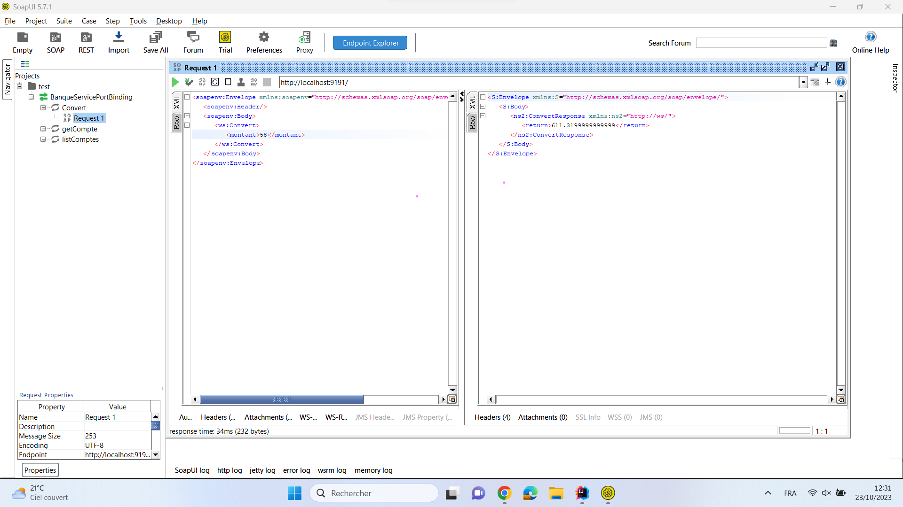

<h1>GASMI MANAL  </h1>
<h1>Activité 1: Web Services SOAP WSDL </h1>

<h3>Informations sur le Web Service</h3>

<h3>Exécution de la requete pour la conversion du solde </h3>

<h3>Exécution de la requete pour récupérer un compte bien précis <h3>

<h3>Exécution de la requete pour lister les comptes</h3>

<h3>Exécution de la requete pour la conversion du solde coté client </h3>

<h3>Exécution de la requete pour récuperer un compte coté client</h3>
